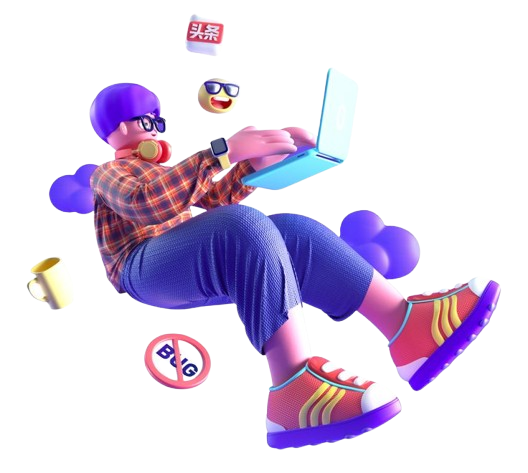
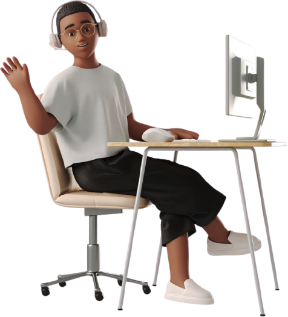
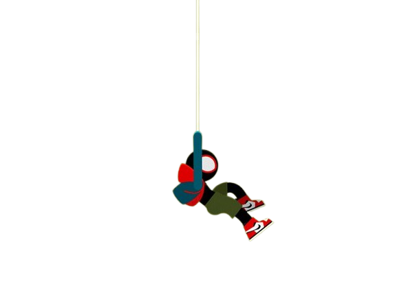
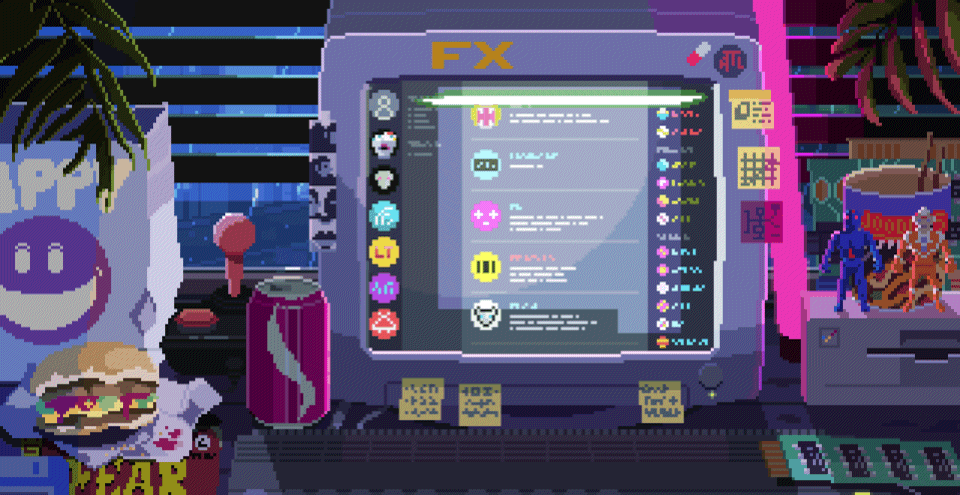

  <table style="border: none; background-color: transparent; width: 100%;">
    <tr>
      <td width="40%" align="center" style="border: none;">
        
      </td>
      <td width="60%" align="center" style="border: none;">
        
         
        

            Bienvenue dans mon espace Github. Ici sont posées plusieurs de mes réalisations personnelles ou celles faites en groupe.
            Je m'amuse à créer, améliorer, tout casser et reconstruire quand c'est nécessaire ^^... Soooo ...enjoy your visit !
        

      </td>
    </tr>
  </table>

   
  
  

 

  

    <h2 style="display:inline-block; cursor:pointer;">😇 Qui se cache derrière le code ?</h2>
  

  
   
  <table style="border: none; width: 100%;">
    <tr>
      <td width="60%" style="border: none;">
        <h3>Curieux et Passiontivé.</h3>
        

            <b>Passiontivé = Passionné + Motivé ^^</b>  
          ReSalut ! Moi, c'est <b>Darill</b>. Au-delà des lignes de code, je vois le développement comme un immense terrain de jeu logique.  
          <b>J'aime apprendre puis tester et à force je peux comprendre <i>pourquoi et comment</i> les choses fonctionnent.</b>  
          C'est important pour moi d'intégrer les mécaniques de base de chaque concept technique afin de  construire des solutions numériques fonctionnelles, optimales, et agréable à utiliser....  Ah ! et aussi j'adore les observations/retours constuctifs puisqu'ils permettent de s'améliorer ✨! 
        

      </td>
      <td width="40%" align="center" style="border: none;">
        
      </td>
    </tr>
  </table>

  

    <h2 style="display:inline-block; cursor:pointer;">🤓 Quelle est la meilleure Stack selon moi ?</h2>
  

   
  <table style="border: none; width: 100%;">
    <tr>
      <td width="30%" align="center" style="border: none;">
        
      </td>
      <td width="70%" style="border: none;">
        <h3>More than just languages...</h3>
        

          On me demande souvent : <i>"C'est quoi ta techno préférée ?"</i>. 
          Pour moi, la stack ultime ne se résume pas au React ou au PHP. C'est une trinité fondamentale :
        

        <ul>
            <li>🔥 <b>Never Stop Learning :</b> La tech évolue vite, et il faut suivre le rythme.</li>
            <li>🇬🇧- <b>English :</b> La langue universelle de la documentation technique.</li>
            <li>✨ <b>Good Code Practices :</b> Ecrire au maximum du code propre, et facilement maintenable...</li>
        </ul>
        

          Les outils changent à une vitesse folle, mais ces principes restent et c'est ça, ma vraie stack.
        

      </td>
    </tr>
  </table>

  

    <h2 style="display:inline-block; cursor:pointer;">⚙️ Ce que je peux apporter dans un projet ou une équipe ?</h2>
  

   
  <table style="border: none; width: 100%;">
    <tr>
      <td width="60%" style="border: none;">
        <h3>Architecture & Design</h3>
        

          Je me situe bien à l'intersection de la <b>logique backend</b> et de la <b>sensibilité frontend :</b>
        

        <ul>
            <li><b>Participer à la conception de A à Z :</b> De la base de données au pixel final en jouant pleinement les rôles qui me sont attribués.</li> 
            <li><b>Optimisation :</b> Rendre le code plus rapide, plus léger, plus lisible.</li> 
            <li><b>Design :</b> J'apprécie les interfaces belles et simples d'utilisation. Je parle donc couramment le language du SaaS Figma, d'Adobe(Ai, Ps, XD) ce qui facilite grandement la collaboration avec les équipes de designers...</li>
        </ul>
      </td>
      <td width="40%" align="center" style="border: none;">
        
      </td>
    </tr>
  </table>

<h3>🛠️ Mon arsenal Technique (en pleine croissance ^^)</h3>

  <table style="border: none; background-color: transparent; width: 100%;">
    <tr>
        <td width="40%" align="center" style="border: none;">
            
        </td>
      <td width="60%" valign="middle" style="border: none;">
        

          
          
          
           
          
          
          
        

         
        

            
            
          
          
          
          
          
        

      </td>
    </tr>
  </table>

 

  
MERCI d’être passé ! N'hésite pas à explorer mes dépôts ou à me pinguer pour discuter Projets, Tech, Gaming ou Bouffe 🍕😉.

  

